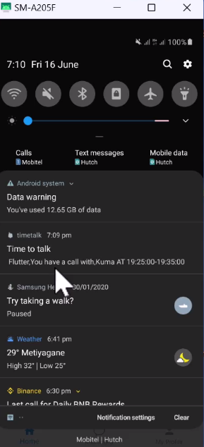

# Timetalk - Flutter video call-based consultant app

Welcome to the Timetalk repository! Timetalk is a video call-based consultant app where users can book consultants. Consultants can schedule appointments on suitable dates. Consultants can earn money from each video call. The app is built using Flutter technologies, including Agora, Websocket, GetX, and Firebase. The backend is developed using Node.js.

 [Please Find Medium Article ](https://medium.com/@pubudupraneeth/time-to-talk-v-0-2-flutter-video-call-schedule-app-intro-3e316c48635f)

# Getting Started

Configure the Agora settings -> constants/settings.dart
Link the backend server -> constants/ApiConstants.dart
And also configure a Paypal Sandbox for payment

To contribute to this project, follow the steps below:

1. Fork this repository to your GitHub account.
2. Clone the forked repository to your local machine.
3. Create a new branch for your contribution.
4. Make the necessary changes and commit them.
5. Push the changes to your forked repository.
6. Open a pull request from your forked repository to the `master` branch of this repository.
7. Wait for the maintainers to review and merge your pull request.
8. Congratulations! You've contributed to this project.

 

## Backend Repository

The Node.js backend for this project can be found at [Node JS Backend](https://github.com/praneethpjFlutter_Video_Consultant_App_BackEnd).

## Bug Reports and Feature Requests

If you encounter any bugs or have ideas for new features, please open an issue in the GitHub repository. Be sure to provide detailed steps to reproduce the issue or a clear explanation of the feature request.

## License

This project is licensed under the [MIT License](https://opensource.org/licenses/MIT).
