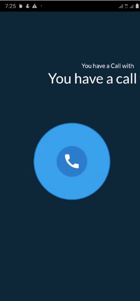

# timetalk

This is a video call-based consultant app where users can book consultants. Consultants can schedule appointments on suitable dates. Consultants can earn money from each video call. The app is built using Flutter technologies, including Agora, Websocket, GetX, and Firebase. The backend is developed using Node.js.

## Getting Started

